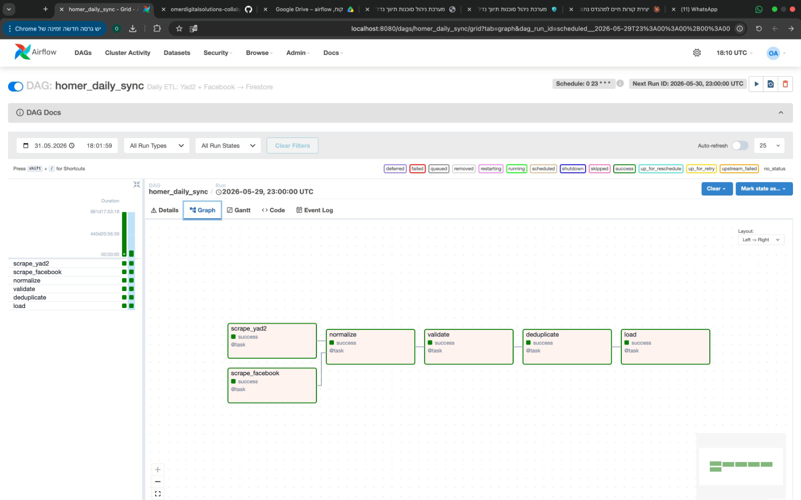

# Homer Airflow ETL


A portfolio project demonstrating production-grade **Apache Airflow** ETL
orchestration skills.  The pipeline ingests Israeli real-estate listings from
two mock sources (Yad2 and Facebook Marketplace), cleans and validates the
data, removes duplicates, and loads unique listings into a mock Firestore
database — every night at 23:00 UTC.

---

## Architecture

```
┌─────────────┐ ──┐
│ scrape_yad2 │   │
└─────────────┘   ├──► normalize ──► validate ──► deduplicate ──► load
┌──────────────┐  │
│ scrape_fb    │ ──┘
└──────────────┘

6 tasks | parallel fan-out → sequential processing
```

---

## Tech Stack

- **Apache Airflow 2.10** — DAG orchestration, scheduling, retries, XCom
- **Python 3.11** — type hints, dataclasses, `logging`, `hashlib`
- **pytest** — unit tests for all pipeline modules
- **Black** — code formatting

---

## Features

- **Parallel scraping** — Yad2 and Facebook tasks run concurrently
- **Data normalization** — cleans prices (strips ₪/,), Hebrew text, room notation (`3,5` → `3.5`)
- **±3σ outlier detection** — rejects price anomalies per deal type (sales vs rentals)
- **Spam filtering** — drops listings with missing cities, zero prices, or test keywords
- **MD5 fingerprinting** — deduplicates across sources with price rounding to ±₪100K
- **Firestore batch writes** — 400 docs/batch (Firestore API limit)
- **XCom data flow** — typed dicts passed between every task
- **Retry logic** — 3 retries with 5-minute delay on any task failure

---

## Project Structure

```
homer-airflow-etl/
├── dags/
│   ├── homer_daily_sync.py        # DAG definition (TaskFlow API)
│   └── pipeline/
│       ├── __init__.py
│       ├── models.py              # TypedDict schemas
│       ├── scrapers.py            # Mock Yad2 + Facebook scrapers
│       ├── normalizer.py          # Price / rooms / Hebrew text normalisation
│       ├── validator.py           # Spam filter + ±3σ outlier detection
│       ├── deduplicator.py        # MD5 fingerprint deduplication
│       └── loader.py              # Mock Firestore batch loader
├── tests/
│   ├── conftest.py                # sys.path setup
│   ├── test_normalizer.py
│   ├── test_validator.py
│   └── test_deduplicator.py
├── docs/
│   └── architecture.md            # Deep-dive technical documentation
├── .gitignore
├── .python-version                # 3.11
├── requirements.txt
├── pyproject.toml                 # black + pytest config
└── README.md
```

---

## Setup

```bash
# 1. Clone
git clone https://github.com/omerdigitalsolutions-collab/homer-airflow-etl.git
cd homer-airflow-etl

# 2. Create virtual environment
python -m venv .venv
source .venv/bin/activate          # Windows: .venv\Scripts\activate

# 3. Set Airflow home (keeps DB and logs inside the project)
export AIRFLOW_HOME=$(pwd)/airflow_home

# 4. Install dependencies
pip install -r requirements.txt

# 5. Initialise the database
airflow db migrate

# 6. Create admin user
airflow users create \
  --username admin \
  --password admin \
  --firstname Omer \
  --lastname Assis \
  --role Admin \
  --email omerasis4@gmail.com
```

---

## Running the DAG

```bash
# Start all Airflow services (webserver + scheduler)
airflow standalone

# In another terminal — verify the DAG is visible
airflow dags list

# Trigger a manual run
airflow dags trigger homer_daily_sync

# Open the UI
open http://localhost:8080
```

The DAG graph and task logs are visible at `http://localhost:8080`.



---

## Testing

```bash
# Run all tests with verbose output
pytest tests/ -v

# Run with coverage report
pytest tests/ -v --cov=dags/pipeline --cov-report=term-missing
```

Expected output:

```
tests/test_normalizer.py::TestNormalizePrice::test_plain_integer_string  PASSED
tests/test_normalizer.py::TestNormalizeRooms::test_comma_decimal         PASSED
...
15 passed in 0.XX seconds
```

---

## Production Note

This project uses **mock data** to demonstrate Airflow orchestration patterns.
The real **Homer CRM** pipeline runs on Firebase Cloud Functions.
To connect to a live Firestore instance, replace the mock `_write_batch()`
function in `loader.py` with `firebase_admin` SDK calls — see the docstring
in that module for the exact snippet.
